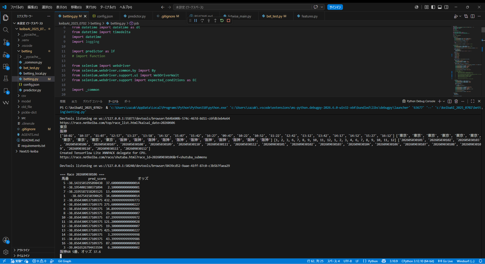
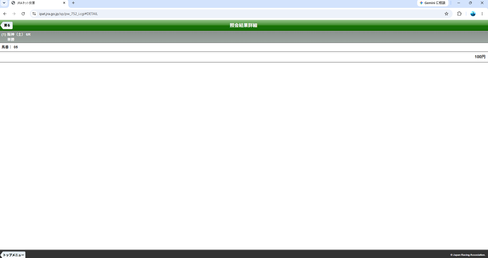

# KeibaAI — Japanese Horse Racing Prediction System

## Background

大学時代、プログラミングスキルの修練のために開発をスタートしました。身近に競馬を楽しむ人が多かったことから、「実際のユーザーの課題を解決するシステムを作れば面白いのでは」と考え、競馬予測AIを開発対象に選定しました。

開発初期は、実務でもデファクトスタンダードである **LightGBM** を採用。スクレイピングによるデータ収集から、データ前処理、ハイパーパラメータチューニング、そして機械学習において最も致命的となる「データリーク（教師データ漏洩）」の対策まで、データサイエンスの一連のパイプラインを地道に構築・習得していきました。

その後、LightGBMによる性能的な限界を突破するため、**ニューラルネットワーク（ListNet）を用いた学習への移行**を決断。目的を達成するために多様な技術アプローチを比較検討する重要性を学びました。特に、損失関数（Loss Function）の設計はLightGBMとの大きな差別化ポイントであり、同時に競馬という複雑なドメインの難解さを痛感した最もタフな挑戦でもありました。

## Automation & UX

モデルの予測精度を上げるだけでなく、**「ユーザーが実際に馬券を購入するまでの体験（UX）」を最適化すること**にこだわりました。どれだけ精度の高い予測が出ても、購入プロセスに手動の手間が残っていては、真の利便性は提供できないと考えたからです。

* **初期実装**: レースIDを手動入力することで購入フローが走る仕組み。
* **現在の実装**: プログラムを一度起動すれば、システムが自動で時間を監視。各レースの締め切り直前にリアルタイムで予想から購入までを完全自動で完結させる仕組みへアップデート。

### 自動購入フロー

```
betting.py 起動
    │
    ├─ 1. [netkeiba.com](https://race.netkeiba.com/top/?rf=navi) から本日の開催情報をスクレイピング
    │   （競馬場・レース時刻・レースID・新馬除く）
    │
    ├─ 2. JRA-IPAT に Selenium で自動ログイン
    │   （config.json の会員情報を使用）
    │
    ├─ 3. 各レースの発走3分前にジョブをスケジュール
    │   （Python schedule ライブラリ）
    │
    ├─ 4. 各レース実行:
    │   ├─ 出走表から馬名・オッズをスクレイピング
    │   ├─ predictor.py で予測確率を計算
    │   ├─ 単勝推奨馬がいる場合 → 単勝投票
    │   └─ ワイド推奨馬がいる場合 → ワイドながし投票
    │
    ├─ 5. エラー発生時は自動リトライ（+ スクリーンショット保存）
    │
    └─ 6. 全レース終了後、自動ログアウト
```

全て Selenium によるブラウザ操作で完結しており、`betting.py` を起動するだけでユーザーの操作は一切不要です。

現在はCLI（コマンドライン）環境での実行に留まっていますが、将来的には誰もが直感的に使えるWebサービスとしての展開（GUI化）を見据えています。そのためのインフラ基盤を設計できるよう、**AWS SAA（ソリューションアーキテクト – アソシエイト）**の資格も取得しました。

### 自動購入の実行例

まず、`betting.py` を実行します。

プログラムは [netkeiba](https://race.netkeiba.com/top/?rf=navi) から開催場所、予想対象レース、レース発走時間などを取得します。

その後、プログラムは待機状態に入ります。

予想対象レースの発走3分前になると、自動でAIによる予想を行い、選定された馬券を購入します。

以下は6月6日、阪神6Rを予想・自動購入した際の例です。
プログラムは12時30分ごろに実行し、レース発走時刻は12時45分です。

発走3分前（今回の場合12時42分）になると画像のように、予想結果を出力します。



馬番、予測スコア、オッズが表示されており、予測スコア順にソートされています。

今回は予想の結果、阪神6R 5番の単勝を購入することになりました。

実際にJRAのネット投票画面で投票履歴を確認すると、阪神6R 5番の単勝が購入されていることが確認できました。



## Engineering Philosophy

> **「AI時代だからこそ、結果の数値だけを過信せず、そのプロセスと健全性を徹底的に疑う」**

これが、この開発を通して得た私のエンジニアリング哲学です。

特に競馬予測においては、回収率が100%を超えるか（＝利益が出るか）という結果のみに一喜一憂しがちです。「結果が良くあってほしい」という開発者自身のバイアスを排除し、提示された高スコアをあえて疑い、データリークなどの問題を泥臭く洗い出す姿勢を徹底しました。実際、データリークによる「ぬか喜び」は幾度も経験し、運用の難しさを痛感させられました。

AIの性能は、データの見せ方次第で「いくらでも良く見せること」ができてしまいます。だからこそ、そのテスト結果が偶然の産物ではないか、統計的にどの程度信頼できるのかという「検証の透明性」に強くこだわりました。結果の良し悪しだけでなく、**「なぜその結果が出るのか」というプロセスに着目し、技術に対して誠実であること**が、実用に耐えうるシステム開発には不可欠であると確信しています。

## Architecture

```
                         +------------------+
                         |  netkeiba.com     |
                         |  (scraping)       |
                         +--------+---------+
                                  |
                                  v
+------------------+    +------------------+
|  build_dataset   |--->|    CSV (data)     |
|  (前処理)        |    +--------+---------+
+------------------+             |
                                 v
           +--------------------+-------------------+
           |                                        |
           v                                        v
+----------------------+              +----------------------+
|  ListNet (PyTorch)   |              |  LightGBM            |
|  src/listwise_main   |              |  src/lightgbm_main   |
|  src/listwise/       |              |  src/lightgbm/       |
+----------------------+              +----------------------+
           |                                        |
           +--------------------+-------------------+
                                |
                                v
                 +----------------------------+
                 |  predictor.py              |
                 |  推論 + 特徴量生成          |
                 +----------------------------+
                                |
                                v
                 +----------------------------+
                 |  betting.py                |
                 |  馬券選択・自動購入         |
                 +----------------------------+
```

## Directory Structure

```
keibaAI/
├── src/
│   ├── build_dataset.py      # データ前処理パイプライン
│   ├── listwise_main.py      # ListNet 学習スクリプト
│   ├── lightgbm_main.py      # LightGBM 学習スクリプト
│   ├── listwise/             # ListNet モジュール
│   │   ├── models.py         # ListNet / ListNet2 / ListNetGRU
│   │   ├── losses.py         # Pairwise ranking loss, EV loss 等
│   │   ├── features.py       # 特徴量エンジニアリング
│   │   ├── dataset.py        # PyTorch Dataset
│   │   ├── model_config.py   # 設定
│   │   └── evaluation.py     # 評価指標
│   ├── lightgbm/
│   │   ├── features.py       # LightGBM 用特徴量
│   │   └── train.py          # LightGBM 学習
│   └── common/
│       ├── preprocessing.py  # スクレイピングデータ前処理
│       ├── transform.py      # 特徴量変換ユーティリティ
│       ├── splits.py         # 時系列CV分割
│       ├── config.py         # マッピング定義
│       ├── utils.py          # 汎用ユーティリティ
│       ├── scraping.py       # スクレイピング
│       └── bandit.py         # バンディットアルゴリズム
├── docs/                     # スクリーンショット・資料
├── betting/
│   ├── predictor.py          # 推論パイプライン
│   ├── betting.py            # 馬券購入
│   ├── betting_local.py      # ローカル馬券購入
│   └── bet_test.py           # 馬券テスト
├── csv/                      # データファイル
├── model/                    # 学習済みモデル
└── pickle-dict/              # 各種マッピング・設定
```

## Key Features

### Two Approaches

| 手法 | モデル | 損失関数 | 特徴 |
|------|--------|---------|------|
| ListNet | PyTorch MLP | Pairwise ranking (`logistic` + `value_i`) | ニューラルネットによる柔軟な非線形表現 |
| LightGBM | LambdaRank | NDCG@k | 勾配ブースティング決定木 |

### Target Encoding

Target Encoding は K-fold CV 内で計算し、リーディングを防止
平滑化（smoothing）により稀少カテゴリの過学習を抑制

### Interaction TE

`['距離グループ', '父馬']`、`['騎手', '距離']`、`['騎手', 'フィールド']` の3つの交互作用に対して Target Encoding を適用
fold 内で計算することでリークを防止

### Pairwise Ranking Loss

`utility_aware_ranking_loss_roi` — 柔軟なペアワイズ損失関数
`pairwise` の種類（hinge / logistic / bpr / exp 等）と `weight_mode`（value_i / roi / ev_i / rank_focus 等）を組み合わせて多様な学習戦略を取れます。

現在は `logistic`（常に滑らかな勾配） + `value_i`（関連度が高い馬を重視）の安定した組み合わせを使用しています。

### Feature Engineering

- **適性スコア**: 過去走の距離・馬場・フィールドから加重平均で算出
- **出走間隔クラス**: 連闘(0)〜長期休養(4)の5クラス分類
- **上がり3F レース内ランク**: 前走の末脚をレース内で順位付け
- **馬体重トレンド**: 過去5走の線形回帰傾き
- **過去同距離・同場所実績**: 同じ距離・場所での成績率
- **Winner Baseline 差分**: 勝ち馬平均との差分特徴量

### Benter Calibration

予測スコアを α-β 較正で確率に変換
fold 間の中央値 α, β を固定値として使うことで安定した ROI を達成

### Odds-Free Modeling

競馬において、オッズ（人気）は市場参加者の総意＝集合知であり、それ自体が最も強力な予測因子です。しかし、オッズを特徴量として含めると：

- 他の特徴量（騎手・馬場実績・血統等）と情報が重複し、相対的に軽視される
- モデルの予測が市場効率に収束し、真の付加価値を出せない
- オッズの変動（直前のオッズ変動など）に脆弱になる

そこで本システムでは、**人気・オッズ関連の特徴量を除外した「odds-free」モデル**を並行して学習し、市場効率に依存しない独自の評価を獲得します。

## Results (5-Fold CV)

### 前提知識：控除率

JRA（日本中央競馬会）では、馬券の売上に対して一定の控除率が設定されています。ワイド（wide）の払戻率は **77.5%**（控除率 22.5%）であり、長期的に馬券を買い続けた場合、平均的な回収率は理論上 **77.5%** に収束します。つまり、回収率 80% を超えるだけで「統計的に優位な予測ができている」と言えます。

### 評価設定

| 項目 | 内容 |
|------|------|
| 対象競馬場 | 中京（Chukyo） |
| 評価期間 | 2022年〜2024年（時系列5-Fold CV） |
| 購入戦略 | 各レースで予測確率 top2 の馬のワイド（ワイド top2）を1点購入 |
| 指標 | 回収率 ROI = 払戻金額 / 購入金額 |

### 各 Signal の定義

| Signal | 分類器 | 人気/オッズ使用 | 説明 |
|--------|--------|:----------:|------|
| `benter_prob (win)` | 1着予測（win） | 使う | **人気・オッズ含む**。Benter 較正済み。市場情報を活用した基準モデル |
| `benter_prob_free` | 1着予測（win） | 使わない | **odds-free**。人気・オッズを除外。市場に依存しない純粋な能力評価 |
| `benter_prob_t2f` | 2着以内予測（top2） | 使わない | **odds-free + top2 タスク**。人気・オッズを除外し、「2着以内に入るか」で直接最適化 |

### ワイド top2 ROI（5-Fold CV）

| Signal | Fold1 | Fold2 | Fold3 | Fold4 | Fold5 | Average | 備考 |
|--------|-------|-------|-------|-------|-------|---------|------|
| benter_prob (win) | 86.9% | 82.2% | 83.8% | 82.5% | 82.4% | **83.6%** | 人気・オッズ込み（基準） |
| benter_prob_free | 85.8% | 82.6% | 80.4% | 84.7% | 84.6% | **83.6%** | odds-free、win 分類器 |
| benter_prob_t2f | 80.8% | 80.1% | 83.7% | 83.8% | 80.8% | **81.8%** | odds-free、top2 分類器 |

**全ての Signal が払戻率 77.5%（控除後）を上回っており、統計的に有意な予測精度を持つことを示しています。**

特に、odds-free モデル（benter_prob_free）が人気・オッズ込みモデルと同等の 83.6% を達成している点は重要です。これは、予測に使用している馬の能力特徴量（騎手・馬場・血統・距離適性 etc.）が、市場効率に依存せずに独自の予測力を発揮できていることを意味します。

## How to Run

```bash
# 1. データ前処理
python src/build_dataset.py

# 2. ListNet 学習
python src/listwise_main.py

# 3. 推論
python -c "from betting.predictor import get_race_predict; get_race_predict('202207040101', 'chukyo', odds=0)"
```

## Requirements

- Python 3.10+
- PyTorch
- LightGBM
- pandas, numpy, scikit-learn
- selenium, beautifulsoup4, requests
- joblib

## Setup

```bash
# インストール
pip install -r requirements.txt

# ログイン設定（自動購入に必要）
cp betting/config.example.json betting/config.json
# → betting/config.json に userid, password, pars を記入
```
